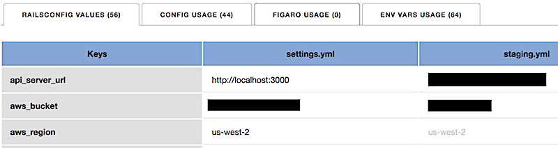

<pre>
 ██████╗██╗      ██████╗ ██╗   ██╗███████╗███████╗ █████╗ ██╗   ██╗
██╔════╝██║     ██╔═══██╗██║   ██║██╔════╝██╔════╝██╔══██╗██║   ██║
██║     ██║     ██║   ██║██║   ██║███████╗█████╗  ███████║██║   ██║
██║     ██║     ██║   ██║██║   ██║╚════██║██╔══╝  ██╔══██║██║   ██║
╚██████╗███████╗╚██████╔╝╚██████╔╝███████║███████╗██║  ██║╚██████╔╝
 ╚═════╝╚══════╝ ╚═════╝  ╚═════╝ ╚══════╝╚══════╝╚═╝  ╚═╝ ╚═════╝
</pre>

A configuration inspector/checker for Ruby on Rails.

Clouseau analyzes your Rails app and provides information about your configuration.

It helps answer the following questions:

* Which config values are being executed in which environment?
* Do any of those values seem suspicious?
* Where in my Rails app are those config values used?
* Where in my Rails app am I using environment variables?

### Config gem
https://github.com/railsconfig/config

* Analyze config's `settings.yml` files to show you all the configured variables and values
* Indicate which values are missing from the base configuration file (aka `settings.yml`)
* Indicate which production values are hard-coded the same as values for other environments
* Indicate which values are derived from other configuration files, and what those derived values will be
* Indicate where in your Rails app all the Config config values are used

### Figaro gem
https://github.com/laserlemon/figaro

* Indicate where in your Rails app all the Figaro config values are used

### Environment Variables

* Indicate where in your Rails app all the environment variables are used

## Installation

1. Clone this repository
2. `cd` into the resulting `clouseau` directory
3. Run `make install`
4. Run `which clouseau` to verify the install was successful

## Usage

### Source repository

`go run clouseau.go --dir=path-to-your-rails-app`

### Compiled binary

`clouseau --dir=path-to-your-rails-app`

If you're currently in your Rails directory, you can just run `clouseau` directly.

## Output

Clouseau generates a static HTML report about your configuration values and their use. After it has run, it will automatically open the resulting HTML page. This file can be found in `clouseau/index.html`.

## Development

**WARNING:** This app has so far only been used on MacOS. No guarantees are provided.

Pull requests, bug reports, feature requests all welcome. If you're a Ruby/Rails dev and there's something you want added to this, don't let the fact that Clouseau is written in Go stop you. Dive in, hack away. Ping me, I'm happy to help.
